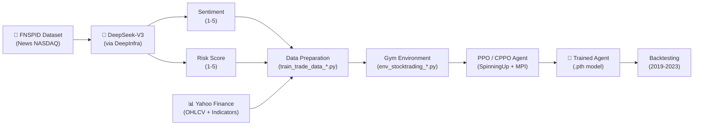
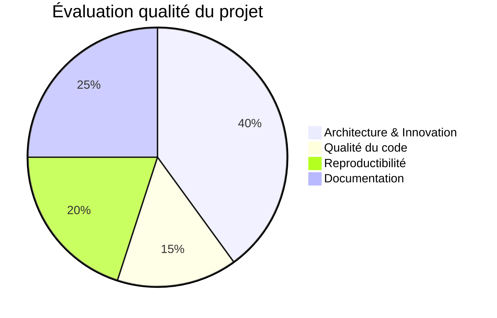

# 🔬 Analyse du Projet FinRL_DeepSeek

## Vue d'ensemble

Ce projet implémente un **agent de trading par Reinforcement Learning (RL) augmenté par LLM** pour le marché NASDAQ 100. Il combine le framework [FinRL](https://github.com/AI4Finance-Foundation/FinRL) avec des signaux LLM (sentiment + risque) générés par **DeepSeek-V3** via l'API DeepInfra, le tout entraîné avec des variantes de PPO issues d'[OpenAI SpinningUp](https://github.com/benstaf/spinningup_pytorch).

> [!IMPORTANT]
> Ce projet est intégré au FinRL officiel d'[AI4Finance](https://github.com/AI4Finance-Foundation/FinRL_DeepSeek) et sert de base à la **Task 1 du FinRL Contest 2025**. Paper: [arXiv:2502.07393](https://arxiv.org/abs/2502.07393).

---

## Architecture du Pipeline



---

## Structure des fichiers

| Catégorie | Fichiers | Rôle |
|-----------|----------|------|
| **LLM Signal Generation** | [sentiment_deepseek_deepinfra.py](file:///c:/Users/s7ven/Documents/Cours/PGE5/AI%20for%20Finance/FinRL_DeepSeek/sentiment_deepseek_deepinfra.py), [risk_deepseek_deepinfra.py](file:///c:/Users/s7ven/Documents/Cours/PGE5/AI%20for%20Finance/FinRL_DeepSeek/risk_deepseek_deepinfra.py) | Appellent DeepSeek-V3 via DeepInfra pour scorer les news (sentiment 1-5, risque 1-5) |
| **Data Preparation** | `train_trade_data_*.py` (×6 variantes) | Fusionnent prix OHLCV + indicateurs techniques + scores LLM |
| **Environments** | `env_stocktrading.py` (base), `env_stocktrading_llm.py`, `env_stocktrading_llm_risk.py` (×3 variantes chaque) | Gym envs avec intégration LLM dans l'espace d'état et modulation des actions |
| **Training** | `train_ppo.py`, `train_cppo.py`, `train_ppo_llm.py`, `train_cppo_llm_risk.py` (+ variantes) | Entraînement PPO/CPPO avec MPI parallélisé (8 workers) |
| **Evaluation** | `FinRL_DeepSeek_backtesting.ipynb` | Backtesting sur la période 2019-2023 |
| **Logs** | `output_*.log` (×14 fichiers) | Historique d'entraînement des différentes expériences |

---

## 4 Agents comparés

| Agent | Algorithme | Signaux LLM | Description |
|-------|-----------|-------------|-------------|
| **PPO** | Proximal Policy Optimization | ❌ Aucun | Baseline FinRL standard |
| **CPPO** | Constrained PPO (CVaR) | ❌ Aucun | PPO + contrainte de risque CVaR |
| **PPO-DeepSeek** | PPO | ✅ Sentiment | PPO avec modulation d'actions par sentiment LLM |
| **CPPO-DeepSeek** | Constrained PPO | ✅ Sentiment + Risk | CPPO avec sentiment dans les actions + risk dans la CVaR |

---

## Analyse technique détaillée

### 1. Génération des signaux LLM

**Architecture du prompt (Few-shot):**
- System prompt définit le rôle d'expert financier
- 2 exemples (user/assistant) pour calibrer le format de sortie
- Batch de N news par requête, réponse attendue: `"3, 4, 2, ..."`

**Points forts:**
- ✅ `temperature=0` pour la reproductibilité
- ✅ Traitement par chunks avec reprise sur crash (`last_processed_row`)
- ✅ Gestion d'erreurs avec `np.nan` en fallback

**Points faibles:**
- ⚠️ Le prompt commence par `"Forget all your previous instructions"` — mauvaise pratique de prompt engineering
- ⚠️ Un seul symbole par batch mais les news peuvent concerner des symboles différents (ligne 93 de `risk_deepseek_deepinfra.py` prend uniquement `df.loc[i, 'Stock_symbol']`)
- ⚠️ Pas de retry mechanism en cas d'erreur API (rate limiting)
- ⚠️ Clé API hardcodée (`api_key= "mykey"`) — pas de gestion via variables d'environnement

---

### 2. Intégration LLM dans l'environnement

**Dans `env_stocktrading_llm_risk.py` — Deux mécanismes:**

#### a) Modulation des actions par sentiment (step function, L307-335)
```
Sentiment 1 (négatif) + Buy  → action *= 0.90 (réduit)
Sentiment 5 (positif) + Sell → action *= 0.90 (réduit)
Sentiment 5 (positif) + Buy  → action *= 1.10 (amplifié)
Sentiment 2 (modéré)  + Buy  → action *= 0.95 (réduit)
```
> C'est un "circuit breaker" : le LLM freine les décisions contraires à son sentiment.

#### b) Pondération du risque CVaR par scores LLM (train_cppo_llm_risk.py, L474-510)
```python
risk_to_weight = {1: 0.99, 2: 0.995, 3: 1.0, 4: 1.005, 5: 1.01}
llm_risk_factor = dot(portfolio_weights, risk_weights)
adjusted_D_pi = llm_risk_factor * (ep_ret + v - r)
```
> Le facteur de risque LLM module la trajectoire estimée, influençant le seuil CVaR.

**Points forts:**
- ✅ Double intégration (actions + contraintes) — approche originale
- ✅ Les scores LLM sont ajoutés dans l'espace d'état complet (le réseau voit tout)

**Points faibles:**
- ⚠️ Les coefficients de modulation (0.9, 0.95, 1.05, 1.1) sont fixés à la main, non appris
- ⚠️ Les weights de risque (0.99→1.01) ont une amplitude très faible — impact potentiellement marginal

---

### 3. Hyperparamètres d'entraînement

| Paramètre | PPO | CPPO-DeepSeek | Commentaire |
|-----------|-----|---------------|-------------|
| `hidden_sizes` | [512, 512] | [512, 512] | Réseaux larges (2 couches) |
| `epochs` | 100 | 100 | Convergence longue |
| `steps_per_epoch` | 20,000 | 20,000 | Grand batch pour le NASDAQ 100 |
| `gamma` | 0.995 | 0.995 | Très orienté long terme |
| `clip_ratio` | 0.7 | 0.7 | ⚠️ **Très élevé** (standard: 0.1-0.3) |
| `target_kl` | 0.35 | 0.35 | ⚠️ **Très relâché** (standard: 0.01-0.05) |
| `pi_lr` | 3e-5 | 3e-5 | Conservateur |
| `vf_lr` | 1e-4 | 1e-4 | Standard |
| `alpha` (CVaR) | — | 0.85 | 85e percentile de risque |
| `beta` (CVaR) | — | 3000.0 | Seuil de contrainte |

> [!WARNING]
> Le `clip_ratio=0.7` et `target_kl=0.35` sont inhabituellement élevés pour du PPO. Cela permet de très grands changements de politique par epoch. Cela peut fonctionner dans ce domaine mais c'est risqué en termes de stabilité.

---

### 4. Résultat clé du paper

> **Bull market → PPO** performe mieux  
> **Bear market → CPPO-DeepSeek** performe mieux

Métriques d'évaluation: Information Ratio, CVaR, Rachev Ratio

---

## Problèmes identifiés & Recommandations

### 🔴 Critiques

| # | Problème | Fichier | Recommandation |
|---|---------|---------|----------------|
| 1 | **Duplication massive de code** — 6 variantes d'env, 6 de training, 6 de data prep quasiment identiques | Tout le projet | Refactorer avec héritage / paramètres de configuration |
| 2 | **Clé API en clair** | `sentiment_deepseek_deepinfra.py` L9 | Utiliser `os.environ['DEEPINFRA_API_KEY']` |
| 3 | **Pas de `requirements.txt`** | — | Créer un fichier de dépendances reproductible |

### 🟡 Importants

| # | Problème | Détail |
|---|---------|--------|
| 4 | **Bug potentiel dans `process_csv`** | L'append en mode `a` peut doubler le header si le fichier existe déjà (L142 de `risk_deepseek_deepinfra.py` : `header=not os.path.exists(output_csv_path)` est vérifié **avant** la première écriture) |
| 5 | **Imports dupliqués** | `numpy` et `torch` sont importés 2 fois dans `train_ppo.py` (L3+L65, L69+L78) |
| 6 | **Mélange de `from_csv_get_risk` et `process_csv`** | Deux fonctions font le même travail avec des implémentations différentes dans `risk_deepseek_deepinfra.py` |
| 7 | **`_initiate_state` incohérent** | L'env LLM risk n'inclut PAS les signaux LLM dans le branch `else` (previous state, L464-490) — potentielle fuite d'information ou crash |
| 8 | **Commentaires `save_state_memory`** | Les colonnes hardcodées (Bitcoin_price, Gold_price) dans `save_state_memory` ne correspondent pas au NASDAQ 100 |

### 🟢 Améliorations

| # | Suggestion | Impact |
|---|-----------|--------|
| 9 | Ajouter un mécanisme de **retry avec backoff** dans les appels API DeepInfra | Robustesse |
| 10 | Rendre les coefficients de modulation LLM **apprenables** (ou au moins configurables) | Performance |
| 11 | Ajouter des **métriques de monitoring** en temps réel (Sharpe rolling, drawdown) | Observabilité |
| 12 | Centraliser les hyperparamètres dans un fichier **config YAML** | Reproductibilité |
| 13 | Ajouter le support de **LLama 3.3 / Qwen** via un flag CLI | Flexibilité |

---

## Résumé de la qualité du code



| Critère | Score | Commentaire |
|---------|-------|-------------|
| **Innovation scientifique** | ⭐⭐⭐⭐⭐ | Double intégration LLM (actions + CVaR) est originale |
| **Résultats expérimentaux** | ⭐⭐⭐⭐ | Conclusion claire (bull/bear), multiples expériences |
| **Qualité du code** | ⭐⭐ | Beaucoup de duplication, pas de tests, code exploratoire |
| **Reproductibilité** | ⭐⭐⭐ | Données sur HuggingFace, mais manque requirements.txt |
| **Documentation** | ⭐⭐⭐ | README solide, commentaires dans le code, mais pas de docstrings systématiques |

---

> [!TIP]
> Ce projet est un **excellent prototype de recherche** avec un paper publié et une intégration officielle FinRL. Pour le transformer en code de production, les priorités seraient: (1) refactoring pour éliminer la duplication, (2) fichier de config centralisé, (3) tests unitaires sur les envs et les signaux LLM.
