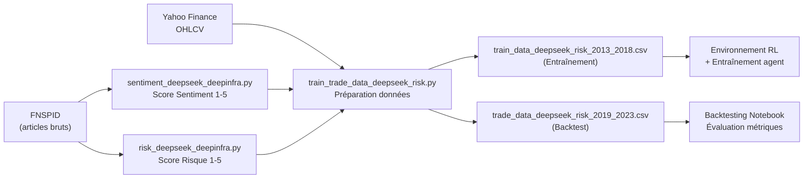
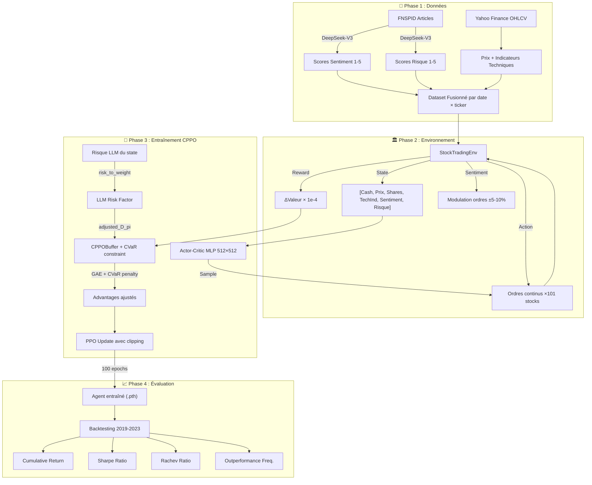

# 📊 Analyse Complète du Projet FinRL-DeepSeek

## 1. Domaine & Contexte

| Aspect | Détail |
|:---|:---|
| **Domaine** | Finance quantitative — Trading algorithmique boursier |
| **Sous-domaines** | Reinforcement Learning (RL) + Natural Language Processing (NLP/LLM) |
| **Compétition** | [FinRL Contest 2025](https://open-finance-lab.github.io/FinRL_Contest_2025/) — Task I : FinRL-DeepSeek for Stock Trading |
| **Paper de référence** | Benhenda (2025) *FinRL-DeepSeek: LLM-Infused Risk-Sensitive RL for Trading Agents* ([arXiv:2502.07393](https://arxiv.org/abs/2502.07393)) |
| **Cadre logiciel** | FinRL (AI4Finance) + OpenAI SpinningUp (PyTorch) + DeepInfra API |

---

## 2. Objectif de la Tâche

> **Développer des agents de trading automatique** entraînés sur les prix boursiers et les actualités financières, en **combinant reinforcement learning et Large Language Models (LLMs)**.

### Métriques d'évaluation du concours
Le score final est la **moyenne des classements** sur ces 4 métriques :

| Métrique | Formule / Interprétation | Direction |
|:---|:---|:---|
| **Cumulative Return** | Rendement total sur la période de test | ↑ plus c'est haut mieux c'est |
| **Rachev Ratio** | `CVaR_α(gains) / CVaR_α(pertes)` — asymétrie favorable des queues de distribution | ↑ |
| **Sharpe Ratio** | `(R̄ - Rf) / σ` — rendement ajusté au risque | ↑ |
| **Outperformance Frequency** | % de jours où l'agent bat le benchmark | ↑ |

---

## 3. Dataset : FNSPID

| Propriété | Valeur |
|:---|:---|
| **Nom** | Financial News and Stock Price Integration Dataset |
| **Source** | [Hugging Face - FNSPID](https://huggingface.co/datasets/Zihan1004/FNSPID) |
| **Couverture** | Actions Nasdaq, 1999-2023 |
| **Volume** | ~15 millions d'articles d'actualité alignés temporellement |
| **Données de prix** | OHLCV (Open, High, Low, Close, Volume) via Yahoo Finance |
| **Univers utilisé** | 101 tickers Nasdaq-100 (juillet 2023) |

---

## 4. Architecture du Pipeline de Données



### 4.1 Extraction des Signaux LLM

Deux scripts parallèles appellent **DeepSeek-V3** via l'API DeepInfra :

#### `sentiment_deepseek_deepinfra.py`
- **Entrée** : Articles résumés (colonne `Lsa_summary`) du FNSPID
- **Sortie** : Score **sentiment** ∈ {1, 2, 3, 4, 5}
  - 1 = négatif, 3 = neutre, 5 = positif
- **Méthode** : Few-shot prompting avec exemples (AAPL +22% → 5, AAPL -30% → 1)
- **Modèle** : `deepseek-ai/DeepSeek-V3`, température = 0
- **Traitement** : par batches de 5 articles, chunk de 100K lignes

#### `risk_deepseek_deepinfra.py`  
- **Entrée** : Mêmes articles résumés
- **Sortie** : Score **risque** ∈ {1, 2, 3, 4, 5}
  - 1 = très faible risque, 3 = modéré (défaut), 5 = très élevé
- **Même architecture** de prompting et d'API

> [!NOTE]
> Les deux scripts utilisent l'API compatible OpenAI via DeepInfra (`base_url="https://api.deepinfra.com/v1/openai"`). L'approche est batch-resumable : si le processus est interrompu, il reprend là où il s'est arrêté grâce aux sauvegardes intermédiaires CSV.

### 4.2 Préparation des Données d'Entraînement

Le script [train_trade_data_deepseek_risk.py](file:///c:/Users/s7ven/Documents/Cours/PGE5/AI%20for%20Finance/FinRL_DeepSeek/train_trade_data_deepseek_risk.py) :

1. **Télécharge** les prix OHLCV via Yahoo Finance pour les 101 tickers Nasdaq-100
2. **Calcule** 10 indicateurs techniques via FinRL (`INDICATORS` : MACD, RSI, etc.)
3. **Fusionne** les scores LLM (sentiment + risque) par date et ticker
4. **Split temporel** :
   - **Entraînement** : 2013-01-01 → 2018-12-31
   - **Test (Backtest)** : 2019-01-01 → 2023-12-31

---

## 5. Les 4 Variantes Algorithmiques

Le projet implémente une **étude d'ablation** avec 4 configurations distinctes :

### Tableau comparatif

| Variante | Script d'entraînement | Environnement | LLM Sentiment | LLM Risque | CVaR (CPPO) |
|:---|:---|:---|:---|:---|:---|
| **A — PPO Baseline** | `train_ppo.py` | `env_stocktrading.py` | ✗ | ✗ | ✗ |
| **B — PPO + DeepSeek** | `train_ppo_llm.py` | `env_stocktrading_llm.py` | ✓ | ✗ | ✗ |
| **C — CPPO Baseline** | `train_cppo.py` | `env_stocktrading.py` | ✗ | ✗ | ✓ |
| **D — CPPO + DeepSeek** | `train_cppo_llm_risk.py` | `env_stocktrading_llm_risk.py` | ✓ | ✓ | ✓ |

---

## 6. Analyse Détaillée du Modèle Principal : CPPO-DeepSeek

### 6.1 Environnement RL — `env_stocktrading_llm_risk.py`

**Espace d'état** (vecteur plat pour chaque pas de temps) :

```
State = [Cash] + [Prix₁..₁₀₁] + [Shares₁..₁₀₁] + [Indicateurs techniques × 101] + [Sentiment LLM₁..₁₀₁] + [Risque LLM₁..₁₀₁]
```

- Dimensions : `1 + 2×101 + (2+10)×101 = 1 + 202 + 1212 = 1415` features (approximation)
- Le `+2` dans la formule vient des 2 signaux LLM ajoutés par stock

**Espace d'action** : Continu, `Box(-1, 1, shape=(101,))`, multiplié par `hmax=100` → ordres de -100 à +100 shares/action/stock

**Fonction de récompense** : 
```python
reward = (end_total_asset - begin_total_asset) * reward_scaling  # reward_scaling = 1e-4
```

**Modulation des actions par le sentiment LLM** (dans `step()`) :

| Condition | Multiplicateur |
|:---|:---|
| Sentiment fort (5) & l'agent veut acheter | ×1.10 (amplifié) |
| Sentiment modéré (4) & l'agent veut acheter | ×1.05 |
| Sentiment fort (1) & l'agent veut acheter | ×0.90 (réduit) |
| Sentiment modéré (2) & l'agent veut acheter | ×0.95 |
| (Symétrique pour les ventes) | |

> [!IMPORTANT]
> Le sentiment LLM agit directement sur le **dimensionnement des ordres** dans l'environnement, pas dans la politique. C'est un mécanisme **pré-exécution** : avant d'envoyer l'ordre au marché, l'environnement ajuste la taille de la position en fonction du signal sentiment.

### 6.2 Algorithme CPPO — `train_cppo_llm_risk.py`

L'algorithme est un **PPO modifié avec contrainte CVaR** (Conditional Value-at-Risk) :

#### Architecture du réseau

```
Actor-Critic MLP:
  - Actor (politique) : obs → [512, 512] → ReLU → actions continues (Gaussien)
  - Critic (valeur)  : obs → [512, 512] → ReLU → valeur scalaire
```

#### Hyperparamètres clés

| Paramètre | Valeur | Rôle |
|:---|:---|:---|
| `epochs` | 100 | Nombre de mises à jour de politique |
| `steps_per_epoch` | 20,000 | Interactions agent-environnement par époque |
| `gamma` | 0.995 | Facteur d'escompte (long terme) |
| `clip_ratio` | 0.7 | Ratio de clipping PPO (permissif) |
| `pi_lr` | 3e-5 | Learning rate politique |
| `vf_lr` | 1e-4 | Learning rate fonction de valeur |
| `alpha` | 0.85 | Paramètre CVaR (percentile de risque) |
| `beta` | 3000.0 | Seuil de contrainte CVaR |
| `train_pi_iters` | 100 | Itérations de descente de gradient par époque |

#### Mécanisme CVaR avec LLM Risk Weights

C'est le **cœur de l'innovation** du projet. Voici la logique critique :

```python
# 1. Extraire les scores de risque LLM du vecteur d'état
llm_risks = next_o[0, -stock_dimension:]  # dernières 101 valeurs = risque LLM

# 2. Convertir en poids via un mapping discret
risk_to_weight = {1: 0.99, 2: 0.995, 3: 1.0, 4: 1.005, 5: 1.01}
llm_risks_weights = np.vectorize(risk_to_weight.get)(llm_risks)

# 3. Calculer le facteur de risque pondéré par le portefeuille
stock_values = prices * shares
stock_weights = stock_values / total_value  # poids relatifs
llm_risk_factor = np.dot(stock_weights, llm_risks_weights)  # pondération

# 4. Ajuster le "return" utilisé dans la contrainte CVaR
adjusted_D_pi = llm_risk_factor * (ep_ret + v - r)

# 5. Si adjusted_D_pi < nu (seuil CVaR), pénaliser
if adjusted_D_pi < nu:
    updates = delay * cvarlam / (1 - alpha) * (nu - adjusted_D_pi)
    updates = min(updates, abs(v) * cvar_clip_ratio)  # clipping
```

> [!IMPORTANT]
> **Logique fondamentale** : Le risque LLM n'est PAS injecté dans la reward directement. Il est intégré dans le **mécanisme de contrainte CVaR** du CPPO. Le facteur de risque LLM *amplifie ou atténue* la sévérité perçue des trajectoires, rendant le CPPO plus sensible aux pertes dans les périodes à haut risque signalées par le LLM. C'est un multiplicateur sur la "performance cumulative ajustée" utilisée pour déterminer les "mauvaises trajectoires" (celles sous le seuil CVaR `nu`).

#### Buffer CPPO vs PPO

La différence clé est le champ `valupdate_buf` dans `CPPOBuffer` :
- **PPOBuffer** : `store(obs, act, rew, val, logp)` — standard
- **CPPOBuffer** : `store(obs, act, rew, val, valupdate, logp)` — ajout de `valupdate` (pénalité CVaR)
- Dans `finish_path()`, les avantages sont ajustés : `adv_buf = adv_buf - valupdate_buf`

---

## 7. Résumé de la Logique du Projet (Flow Complet)



---

## 8. Points d'Attention & Observations

### 8.1 Forces du projet
- ✅ **Double intégration LLM** : Le sentiment module les actions, le risque module la contrainte CVaR — pas de double-comptage
- ✅ **Étude d'ablation** rigoureuse avec 4 variantes (A, B, C, D)
- ✅ **Pipeline reproductible** : données sur Hugging Face, scripts enchaînables
- ✅ **Multi-LLM testé** : DeepSeek-V3, Llama-3.3-70B, Qwen-2.5-72B (code commenté)
- ✅ **Parallélisation MPI** pour l'entraînement distribué

### 8.2 Points d'attention

> [!WARNING]
> **Mapping risque → poids très faible** : `{1: 0.99, 2: 0.995, 3: 1.0, 4: 1.005, 5: 1.01}` — les poids varient de seulement ±1%. L'impact réel du risque LLM sur la contrainte CVaR est potentiellement marginal dans la configuration actuelle.

> [!NOTE]
> **Valeurs manquantes** : Le sentiment manquant est remplacé par 0 (hors échelle 1-5), le risque manquant par 3 (neutre). Le 0 pour le sentiment ne correspond pas à un masque explicite dans l'environnement.

> [!NOTE]
> **Pas de Circuit-Breaker dans le code actuel** : La présentation mentionne un Module 3 "Circuit-Breaker" et un mécanisme de signaux pondérés par confiance, mais ces éléments ne sont **pas encore implémentés** dans le code source. Ce sont des propositions architecturales pour l'amélioration future.

---

## 9. Structure des Fichiers

| Catégorie | Fichiers | Rôle |
|:---|:---|:---|
| **Extraction LLM** | `sentiment_deepseek_deepinfra.py`, `risk_deepseek_deepinfra.py` | Appels API DeepSeek pour scorer les articles |
| **Préparation données** | `train_trade_data*.py` | Fusion prix + indicateurs + signaux LLM |
| **Environnements RL** | `env_stocktrading.py` (baseline), `env_stocktrading_llm.py` (+ sentiment), `env_stocktrading_llm_risk.py` (+ sentiment + risque) | Gym environments |
| **Entraînement** | `train_ppo.py`, `train_cppo.py`, `train_ppo_llm.py`, `train_cppo_llm_risk.py` | PPO et CPPO avec/sans LLM |
| **Évaluation** | `FinRL_DeepSeek_backtesting.ipynb` | Notebook Colab de backtesting |
| **Logs** | `output_*.log` | Logs d'entraînement (EpRet, KL, ClipFrac) |
| **Présentation** | `presentation.html` | 15 slides sur l'approche "Risk-First" |

---

## 10. Conclusion sur le Positionnement

Ce projet se positionne comme une **extension risk-sensitive** du projet FinRL-DeepSeek original. L'innovation principale est l'intégration des **scores de risque LLM dans le mécanisme de contrainte CVaR** de l'algorithme CPPO, plutôt que comme simple reward shaping. La présentation propose des améliorations futures (Circuit-Breaker, signaux pondérés par confiance) qui ne sont pas encore dans le code mais représentent la vision architecturale complète.

Le projet est directement aligné avec la **Task I du FinRL Contest 2025**, qui encourage l'innovation autour de :
- Nouveaux prompts pour le LLM
- Nouvelles façons d'injecter les signaux NLP dans l'agent RL  
- Nouveaux algorithmes RL (GRPO, méthodes DeepSeek-R1)
