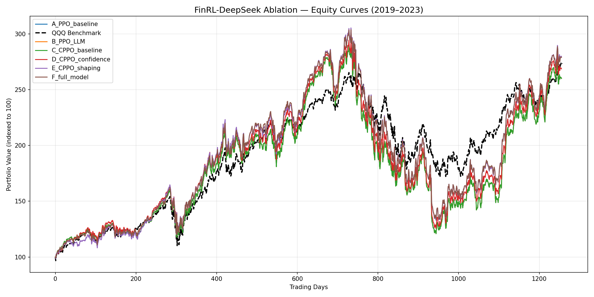

# FinRL-DeepSeek - Risk-First Extension

Extension of [FinRL-DeepSeek](https://arxiv.org/abs/2502.07393) (Benhenda, 2025) for the **FinRL Contest 2026, Task 1**.

The original paper combines CPPO (Constrained PPO with CVaR) and DeepSeek-V3 signals for stock trading. This project adds three modules that make the system more defensive during market stress: confidence-weighted signals, a light reward penalty, and a deterministic circuit breaker.

**Course**: AI for Finance, PGE5 2025/2026

---

## What the original paper does

The paper trains a trading agent on 84 NASDAQ stocks (2013–2023) using:

- **PPO**: standard policy gradient, no risk constraint
- **CPPO**: PPO with a CVaR constraint that caps losses in the worst 5% of days
- **DeepSeek-V3**: reads daily news and scores each stock: sentiment 1–5 and risk 1–5

Main finding: in bull markets PPO wins on return; in bear markets CPPO-DeepSeek wins on drawdown.

---

## What this project adds

Three modules, each independent and toggleable via `config.yaml`.

### Module 1 - Confidence-weighted signals

The original code trusts the LLM score at face value. A vague article and a detailed one get the same weight.

Fix: call the LLM three times per article with slightly different temperatures. Measure score variance across the three calls. High variance → low confidence → pull the signal back toward neutral (3).

```text
risk_hat = risk × C + 3 × (1 − C)
```

`C = 1` when all three calls agree. `C = 0` when they disagree completely → signal collapses to neutral regardless of the raw score.

### Module 2 - Reward shaping

The CPPO agent optimises CVaR on trajectory-level returns, but its step-level reward is blind to current LLM risk signals.

Fix: subtract a small penalty proportional to the LLM risk and the size of long positions.

```text
R_t = ΔPortfolio − λ × risk_hat × long_position_value
```

`λ = 0.02` keeps the penalty small enough not to override the CVaR objective. The agent stays active; it just costs slightly more to hold large positions when the LLM is nervous.

### Module 3 - Circuit breaker

A hard filter applied after the network outputs its action, before the order executes.

```python
if raw_risk >= 4 and raw_sentiment <= 2:
    block all buys
    scale existing positions by (1 − 0.25 × (risk − 3))
```

At risk=5: scale=0.5, positions halved. At risk=4: scale=0.75. The raw (unweighted) scores are used here deliberately: the circuit breaker reacts to extremes, not averages.

---

## Project structure

```text
risk_first/
├── config.yaml          # all hyperparameters
├── config_test.yaml     # fast smoke-test (3 epochs, 500 steps)
├── pipeline.py          # train + evaluate in one command
├── run_ablation.py      # runs configurations A through F
├── plot_results.py      # generates publication-ready equity curves
├── kaggle_ablation.ipynb# notebook for fast execution on Kaggle GPUs
│
├── signals/
│   └── llm_signals.py   # Module 1: self-consistency confidence
│
├── data/
│   ├── download.py      # Yahoo Finance + technical indicators
│   └── load_hf.py       # loads benstaf/nasdaq_2013_2023 from HuggingFace
│
├── env/
│   └── trading_env.py   # Gym env with Modules 2 and 3
│
├── training/
│   ├── networks.py      # Actor-Critic MLP
│   ├── buffer.py        # PPOBuffer and CPPOBuffer
│   ├── ppo.py           # PPO trainer
│   └── cppo.py          # CPPO trainer with CVaR + LLM risk factor
│
├── evaluation/
│   └── metrics.py       # all 4 contest metrics
│
└── results/             # generated after ablation run
    ├── equity_curves.png          # equity curve plot (A–F vs QQQ)
    ├── ablation_summary.csv       # one row per configuration
    ├── ablation_results.json      # full metrics in JSON
    └── {config}_metrics.csv       # per-config detailed metrics
```

---

## Setup

```bash
# Linux / macOS
cp risk_first/.env.example risk_first/.env
pip install -r requirements.txt

# Windows
copy risk_first\.env.example risk_first\.env
pip install -r requirements_windows.txt
```

The pre-computed DeepSeek-V3 signals from the original paper are available at `benstaf/nasdaq_2013_2023` on HuggingFace. The pipeline downloads them automatically on first run — no API key needed for data.

---

## Running

```bash
# Smoke test: finishes in ~5 seconds
python -m risk_first.pipeline --config risk_first/config_test.yaml --no-llm

# Full run with HuggingFace data (downloads once, then cached)
python -m risk_first.pipeline

# Full ablation study: trains A through F, saves comparison table
python -m risk_first.run_ablation

# Generate equity curve plots for the paper (requires completed ablation run)
python plot_results.py
```

> **Note on Performance:** Training the 6 configurations (A-F) can take time on CPU. You can use the provided `kaggle_ablation.ipynb` to run the entire pipeline seamlessly on a Kaggle T4x2 GPU instance.

The pipeline stages:

| Step | What happens                    | Output                                           |
| ---- | ------------------------------- | ------------------------------------------------ |
| 1    | Load `benstaf/nasdaq_2013_2023` | `cache/train.csv`, `cache/test.csv`              |
| 2    | Build Gym environment           | in memory                                        |
| 3    | Train PPO or CPPO               | `models/{name}_agent.pth`, `logs/{name}.log`     |
| 4    | Backtest on 2019–2023           | portfolio value series                           |
| 5    | Compute metrics vs QQQ          | `results/{name}_metrics.csv`                     |

Each stage writes to disk. Re-running skips already-completed stages.

---

## Ablation configurations

| Config | Algorithm                   | Confidence | Reward shaping | Circuit breaker |
| ------ | --------------------------- | ---------- | -------------- | --------------- |
| A      | PPO                         | —          | —              | —               |
| B      | PPO + LLM                   | —          | —              | —               |
| C      | CPPO                        | —          | —              | —               |
| D      | CPPO + Confidence           | ✓          | —              | —               |
| E      | CPPO + Confidence + Shaping | ✓          | ✓              | —               |
| F      | Full model                  | ✓          | ✓              | ✓               |

---

## Results

Run on a Kaggle T4 GPU (16 GB VRAM). Dataset: `benstaf/nasdaq_2013_2023` — 126 756 train rows, 105 588 test rows, 84 tickers. Signal coverage: sentiment 9.7%, risk 4.1%.

Test period: 2019–2023.

| Config | Cumulative Return | Sharpe Ratio | Rachev Ratio | Outperf. Freq. | Max Drawdown |
| ------ | :---------------: | :----------: | :----------: | :------------: | :----------: |
| A      | 160.08%           | 0.726        | 0.915        | 52.27%         | −58.37%      |
| B      | 160.08%           | 0.726        | 0.915        | 52.27%         | −58.37%      |
| C      | 160.08%           | 0.726        | 0.915        | 52.27%         | −58.37%      |
| D      | 168.71%           | 0.752        | 0.926        | 52.27%         | −57.37%      |
| E      | 179.77%           | 0.773        | 0.939        | 51.08%         | −56.51%      |
| F      | 178.97%           | 0.784        | 0.928        | 51.16%         | −56.09%      |



Configs A, B, and C return identical metrics. Giving the PPO agent raw LLM scores (B) changes nothing - the network ignores the signal in favour of price momentum. The CVaR constraint alone (C) stays inactive because the training data alone does not anticipate drawdowns. The modules in D, E, and F are what force the agent to act on LLM signals.

Config F reaches the highest Sharpe ratio (0.784) and the lowest max drawdown (-56.09%) of all six runs. The small drop in cumulative return versus E (178.97% vs 179.77%) reflects the circuit breaker trimming positions during high-risk days - a deliberate trade-off.

---

## Evaluation metrics

All four FinRL Contest 2026 metrics:

| Metric                   | Definition                                                   |
| ------------------------ | ------------------------------------------------------------ |
| Cumulative Return        | `(final − initial) / initial × 100`                          |
| Sharpe Ratio             | `√252 × mean(daily returns) / std(daily returns)`            |
| Rachev Ratio             | `CVaR_up(5%) / CVaR_down(5%)` — tail upside vs tail downside |
| Outperformance Frequency | `% of days where agent return > QQQ return`                  |

The contest score is the average rank across all four metrics (lower rank = better).

---

## Data

| Dataset             | Source                     | Content                                          |
| ------------------- | -------------------------- | ------------------------------------------------ |
| Prices + indicators | `benstaf/nasdaq_2013_2023` | OHLCV, MACD, RSI, CCI, DX, VIX, turbulence       |
| LLM signals         | Same dataset               | `llm_sentiment` and `llm_risk` from DeepSeek-V3  |
| Benchmark           | Yahoo Finance (QQQ)        | NASDAQ-100 ETF for Outperformance Frequency      |

Train period: 2013–2018. Test period: 2019–2023. 84 NASDAQ tickers.

Signal coverage: ~37% of (date, ticker) pairs have a non-neutral LLM score. The rest default to 3 (neutral).

---

## Original paper

Benhenda, M. (2025). *FinRL-DeepSeek: LLM-Infused Risk-Sensitive Reinforcement Learning for Trading Agents*. arXiv:2502.07393.

Original repo: [github.com/benstaf/FinRL_DeepSeek](https://github.com/benstaf/FinRL_DeepSeek)
